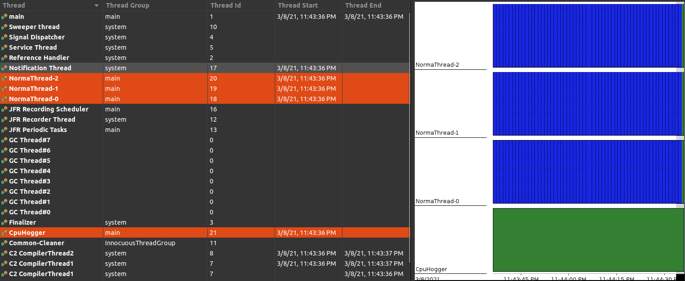

# CPU hogger thread/s
The case where there is an [application](../../../src/java/org/padaiyal/wiki/performance/CpuHoggerScenario.java) 
with a thread that hogs the CPU.

## Symptoms
* Java application has lower performance and may also slow down the system.
* System may be unresponsive.
## Triage process
The following tools can be used to triage the issue:
### Using jStack
Generate a [thread dump](../debug_tools/jstack.md) when the CPU usage is high to get detailed information about thread activity. 
Multiple thread dumps can be used to monitor thread activity over time.

### Using VisualVM
Retrieve a visual representation of [thread activity](../debug_tools/visualvm.md) when CPU usage is high.

### Using jFlightRecorder and Java Mission Control
Retrieve a visual representation of [thread activity](../debug_tools/java_flight_recorder.md) within a specified length of time.

The jfr file generated for this application can be found [here](cpu_hogger_thread_info.jfr).
### Using jVaidhiyar
Retrieve [thread information](../debug_tools/jvaidhiyar.md) to analyze CPU usage of each thread.

## Trigger code
The implemented [application](../../../src/java/org/padaiyal/wiki/performance/CpuHoggerScenario.java) has two types of threads: CpuHogger thread and NormalThread. 
CpuHogger generates a large CPU consumption by increasing a counter continuously. 
NormalThread is similar, but it sleeps in between iteration and is used as baseline to compare to CPUHogger thread. 
The application generates 3 low CPU usage threads, and a high CPU usage thread.

## Remediation steps
* Add hard limits to size of inputs.
* If hard limits aren't possible, add a soft limit after which a warning will be generated.

