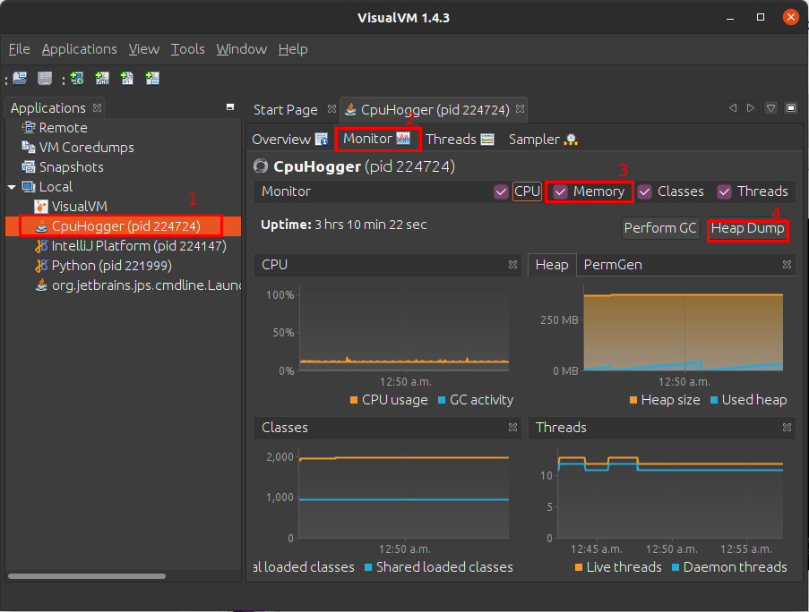
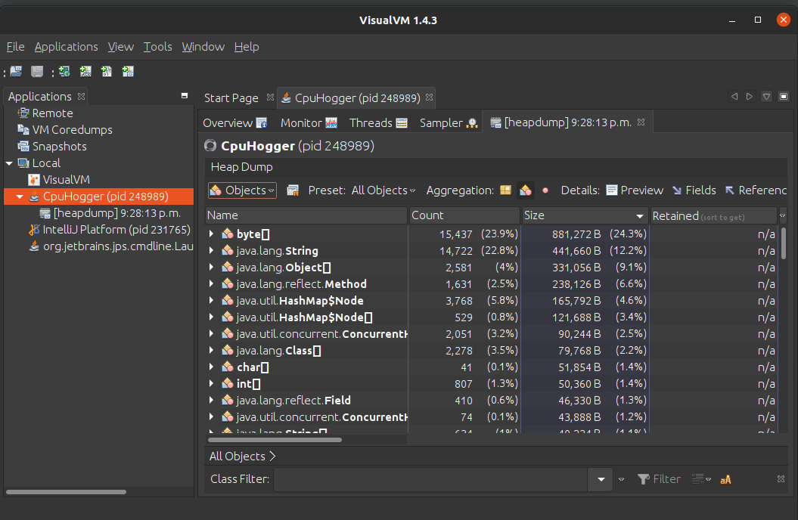
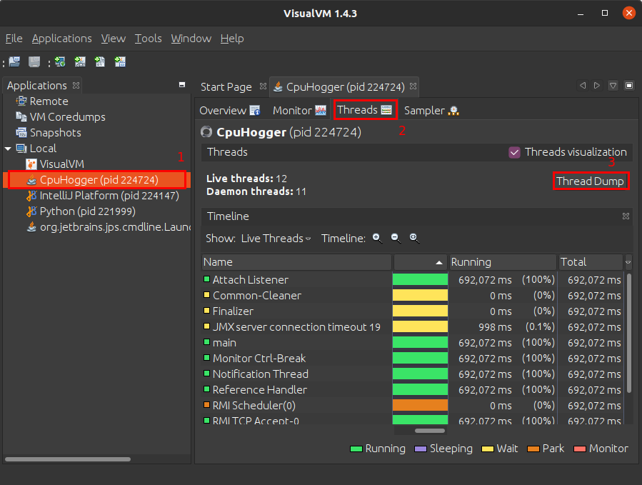
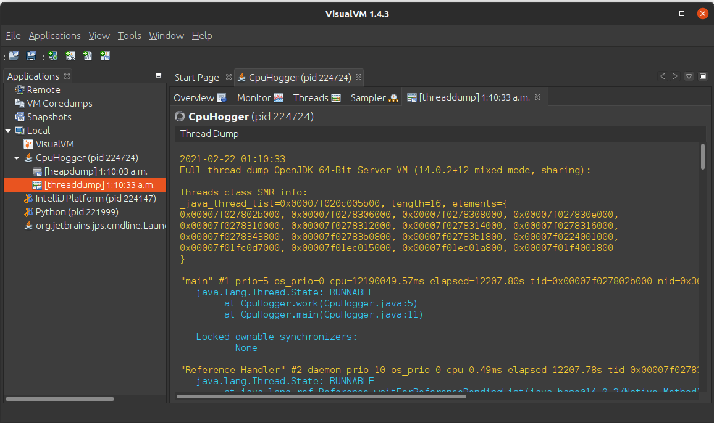

# VisualVM 
VisualVM is a graphical tool that displays detailed information on Java application running in the Java Virtual Machine. It can be used to troubleshoot and profile those applications [1].  

This tool can be downloaded [here](https://visualvm.github.io/).

# Heap information

To generate a heap dump follow these steps:
1. Open VisualVM.
2. Select the Java application the right panel.
4. Check the Memory checkbox in the top-right corner to view the current state of the heap.
5. Click on the Heap Dump button to view the heap dump generated by VisualVM.  

Information on the generated heap dump can be viewed here: 

Or the heap dump can be analyzed using tools like Eclipse Memory Analyzer Tool (MAT) as shown [here](https://www.vogella.com/tutorials/EclipseMemoryAnalyzer/article.html).
 

## Thread information
To view the thread information follow these steps:
1. Open VisualVM.
2. Select the Java application to track from the Application list on the left panel.
3. Click on the Thread tab from the right panel to view live thread data.
4. Click on the Thread Dump button to generate a thread dump.  

Sample Thread dump output: 

Use this [guide](https://dzone.com/articles/how-to-read-a-thread-dump) to understand the output generated. 

# Garbage collection information
To view garbage collection activity follow these steps:
1. Open VisualVM,
2. Select the Java application to track from the Application list on the left panel.
3. Click on the Monitor tab from the right panel.
4. Check the CPU checkbox in the top-right corner to view the garbage collection activity.

## References
[1] https://docs.oracle.com/javase/8/docs/technotes/guides/visualvm/index.html