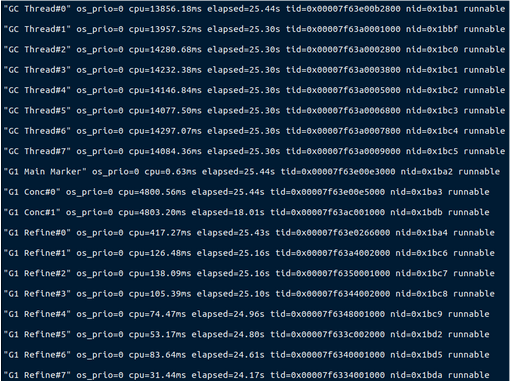
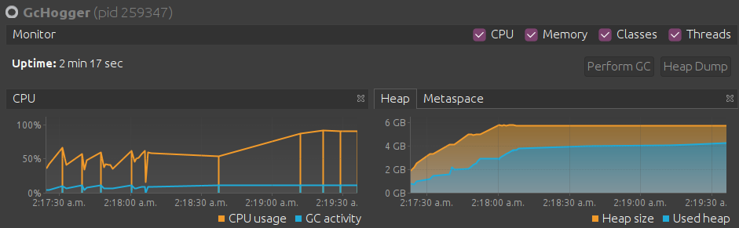
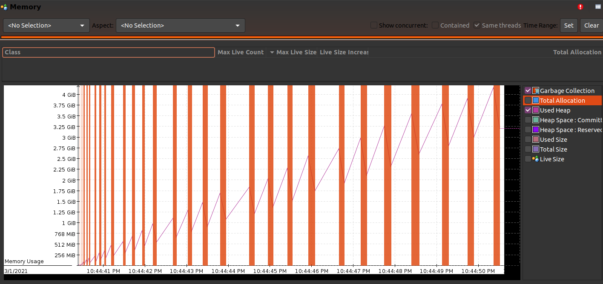

# High GC activity
This case occurs when there is a high garbage collection activity, which is caused by the high memory usage of a Java application.
## Symptoms
* Java application will have higher CPU usage as the Garbage Collector may need to work overtime to sweep unused objects from the heap.
* Java application could crash with `java.lang.OutOfMemoryError: Java heap space` if the Garbage Collector is not able to de-allocate more memory what is needed to allocate.

## Triage process
### Using jStack
[Generate thread dump](../debug_tools/jstack.md) to analyze garbage collector's threads activity.
Multiple thread dumps can be used to monitor thread activity over time.

### Using jVisualVM
[Analyze threads](../debug_tools/visualvm.md#thread-information) that are running when the memory usage is high to correlate culpable threads with high memory usage.
[Generate a heap dump](../debug_tools/visualvm.md#heap-information) when the [garbage collector activity](../debug_tools/visualvm.md#garbage-collection-information) is high to identify large unused objects.

### Using jFlightRecorder and Java Mission Control
[Analyze heap usage and garbage collector activity](../debug_tools/java_flight_recorder.md) to correlate culpable large unused objects.

The jfr file generated for this application can be found [here](gc_hogger.jfr).

### Using Vaidhiyar
Retrieve [garbage collection info](../debug_tools/jvaidhiyar.md#garbage-collection-information) to evaluate heap size and memory usage.

### Using jMap
[Generate a heap dump](../debug_tools/jmap.md) to see if heap usage is close to the heap size.

## Trigger code
An application that creates multiple instances of an object can be found [here](/src/java/org/padaiyal/wiki/performance/GcHogger.java)
The large number of objects generated will cause the heap to run out of memory which in turn triggers the garbage collector.

## Remediation steps
* Set a maximum limit for the input.
* Change the logic of the code, like remove unnecessary object creation.
* Do not create unnecessary classes, like Number, as Long already has the all the functionality that Number provides.
